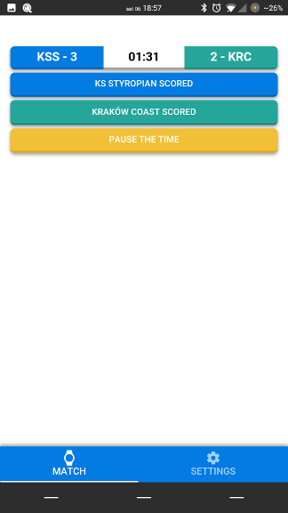
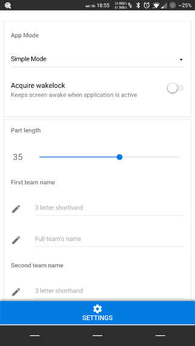

# Giermek / Squire

> Match Stopwatch / Stoper Meczowy

## Description / Opis

***English***
I'm playing with my friends in amateur league of football,
in project called [playarena.pl](playarena.pl). Sometimes, matches
finish with a really high score and it's hard to keep up — that's why I made
this simple app, which lets you start the stopwatch and update the score. I was
also testing some technologies, so this app is written in TypeScript, using
Quasar Framework and Cordova, utilizing Mocha, Chai and Wdio for testings.
Development setup instructions are below. Currently only English language is
built-in. It was tested on Android phones, but should be easly portable to iOS.

***Polish***
Razem ze znajomymi grywamy w amatorskiej lidze w ramach projektu
[playarena.pl](playarena.pl). Czasami zdarzają się spotkania, gdzie wyniku nie
da się policzyć na palcach, dlatego napisałem tę aplikację, która powinna pomóc
w załatwieniu sprawy. Jest to prosty minutnik / stoper, z możliwością dodawania
i odejmowania goli obydwu drużynom. Jako, że chciałem przetestować kilka nowych
technologii, to wykorzystałem do jej budowy TypeScript, Quasar Framework oraz
Cordovę, a do testów Mocha, Chai i WDio. W obecnej chwili interfejs jest dostępny
jedynie w języku angielskim. Aplikacja była testowana na telefonach z Androidem,
ale port na iOS nie powinien być problemem.

## Download / Pobieranie

***English*** I'm working on getting Squire to the F-Droid repositories,
currently it's available in the "Releases" section on GitHub.

***Polish*** Aplikacja wkrótce będzie dostępna w repozytoriach F-Droid, obecnie jest
dostępna do pobrania z zakładki "Releases" na GitHubie.

## Screenshots / Zrzuty ekranu




## License / Licencja

***English*** Squire is licensed under GNU General Public License v3.0. License
is available in repository.

***Polish*** Giermek jest licencjonowany za pomocą GNU General Public License
v3.0. Licencja jest dostępna w repozytorium.


## Development Setup

``` bash
# install dependencies
$ yarn

# serve with hot reload at localhost:8080
$ yarn run dev

# build for production with minification
$ yarn run build

# run unit tests using mocha + chai
$ yarn run unit

# run e2e tests using wdio
$ yarn run e2e

# run full test suite
$ yarn run test

# build for android
$ yarn run build
$ cd cordova # project_directory/cordova
$ cordova build android
```
